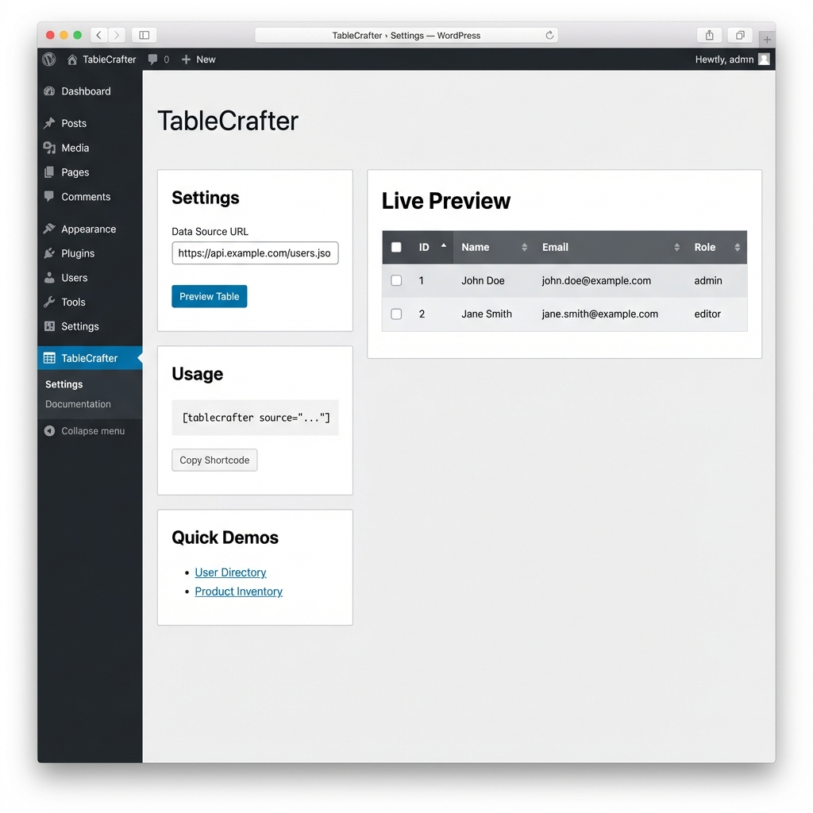
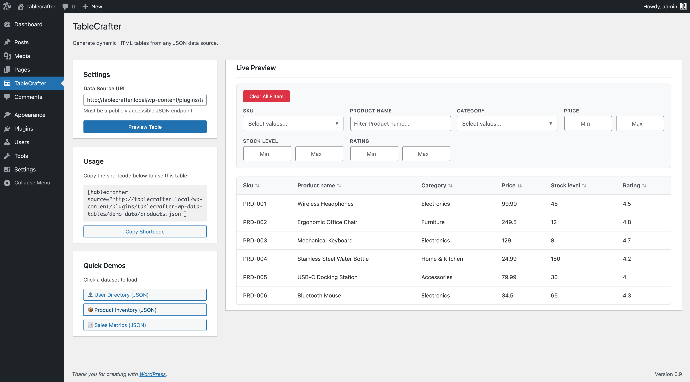

# TableCrafter – JSON Data Tables & API Data Viewer

**Contributors:** fahdi
**Tags:** table, json, api, data table, datatables
**Requires at least:** 5.0
**Tested up to:** 6.9
**Stable tag:** 1.1.0
**Requires PHP:** 7.4
**License:** GPLv2 or later
**License URI:** https://www.gnu.org/licenses/gpl-2.0.html
**Donate link:** https://www.paypal.me/fahadmurtaza

Create dynamic, responsive HTML tables from any JSON API or file. A lightweight, no-code alternative to complex table plugins.

## Description

**TableCrafter** is the ultimate lightweight solution for displaying dynamic data in WordPress. 

Unlike heavy table builders that bloat your database, TableCrafter acts as a direct window to your data. Connect to any external API or JSON file, and we'll render a beautiful, responsive table instantly. 

We fill the gap between complex, expensive plugins like *wpDataTables/TablePress* and raw HTML tables. 

**Why choose TableCrafter?**
*   **🏎️ Blazing Fast:** Zero database bloat. Data is fetched on-the-fly via JavaScript.
*   **🔗 Dynamic & Live:** Perfect for financial data, stock tickers, crypto prices, or live inventory that changes every minute.
*   **📱 Mobile Ready:** Automatically responsive tables that look great on phones.
*   **🛠️ Zero Config:** Smart column detection means you just paste a URL, and we handle the rest.

### 🚀 Key Features

*   **Universal JSON Support:** Works with any public API or `.json` file.
*   **Smart Auto-Formatting:** Automatically detects headers and formats data intelligently.
*   **Live Admin Preview:** Test your API endpoints directly in the customized dashboard.
*   **Developer Friendly:** Vanilla JavaScript core with no jQuery dependencies.

### 💡 Powerful Use Cases

*   **Crypto & Finance Portals:** Display live Bitcoin/ETH prices from CoinGecko or Binance APIs.
*   **Company Intranets:** Show employee directories fetched from your internal HR systems.
*   **E-Commerce Stock:** Display real-time product availability from external suppliers.
*   **Open Data Projects:** Visualize government datasets, weather data, or sports statistics.
*   **Affiliate Marketers:** Create dynamic comparison tables that auto-update from a central JSON feed.

## Installation

1.  Upload the `tablecrafter` folder to the `/wp-content/plugins/` directory.
2.  Activate the plugin through the 'Plugins' menu in WordPress.
3.  Navigate to the **TableCrafter** admin menu.
4.  Paste your JSON URL to generate a shortcode.
5.  Add `[tablecrafter source="YOUR_URL"]` to any page.

## Usage

The `[tablecrafter]` shortcode is highly flexible. Use the following attributes to customize your data display:

*   **source**: (Required) The URL to your JSON API or file.
*   **include**: (Optional) A comma-separated list of keys you want to show. Perfect for limiting data from large APIs.
*   **exclude**: (Optional) A comma-separated list of keys you want to hide.
*   **id**: (Optional) A custom CSS ID for the table container.

### Examples:

**1. Basic Display**
Show all data from an API:
```text
[tablecrafter source="https://api.coingecko.com/api/v3/coins/markets?vs_currency=usd"]
```

**2. Specific Columns (Curated View)**
Only show the name, price, and symbol:
```text
[tablecrafter source="..." include="name,current_price,symbol"]
```

**3. Cleanup (Exclude Fields)**
Hide internal IDs or long descriptions:
```text
[tablecrafter source="..." exclude="id,last_updated,roi"]
```

**4. Custom Styling**
Target your table with specific CSS:
```text
[tablecrafter source="..." id="my-custom-table"]
```

## Frequently Asked Questions

### Does this store data in my WordPress database?
No! That's the beauty of TableCrafter. It's a lightweight *viewer*. Your data stays in the JSON source, keeping your WordPress site fast and your database clean.

### My API has Cross-Origin (CORS) errors. What do I do?
TableCrafter includes a built-in server-side proxy that automatically bypasses most CORS restrictions. If your browser blocks the request, the plugin will securely fetch the data via your WordPress server instead. This happens automatically—no configuration needed!

### Can I use this for CSV files?
TableCrafter is optimized for the modern web (JSON). However, we are exploring CSV support for future versions. For now, we recommend converting CSV to JSON for the best performance.

## Screenshots

### 1. Admin Dashboard Preview
The TableCrafter settings panel with live preview functionality. Enter any JSON URL (or select from demo URLs) and see your data rendered instantly in the WordPress admin.



### 2. Frontend Table Display
A clean, responsive data table as it appears on your website. Automatically formatted and mobile-friendly.



## Changelog

### 1.1.0
* Feat: Added Server-Side Proxy to bypass CORS restrictions.
* Feat: Added Automated Background Cache Warming via WP-Cron.
* Feat: Added WP-CLI support for cache management.
* Fixed: Resolved shortcode rendering issues in various theme environments.
* Fixed: Prevented "smart quote" conversion in documentation to ensure copy-paste reliability.
* Fixed: Optimized frontend initialization to prevent race conditions.
* Docs: Updated branding and donation links.
* Docs: Removed comparison section.

### 1.0.1
* Refactored script handling for full WP.org directory compliance.
* Moved all inline JavaScript to external files.
* Implemented wp_localize_script for safer data handling in admin.
* Optimized shortcode renderer to eliminate inline JS injection.

### 1.0.0
*   Initial release.
*   Added live admin previewer.
*   Released smart column detection.
