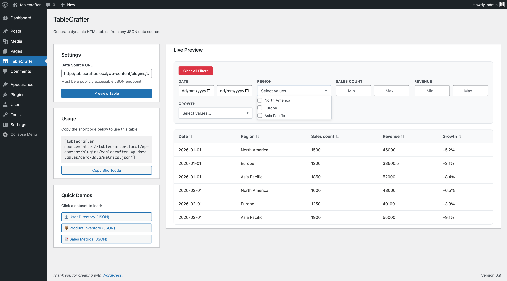

# 🚀 TableCrafter: WordPress Data Tables & Dynamic Content Plugin

**Transform any JSON API or CSV into beautiful, responsive WordPress data tables. Features live search, pagination, sorting, mobile optimization, and SEO-friendly server-side rendering.**

[](https://tastewp.org/plugins/tablecrafter-wp-data-tables)
[](https://wordpress.org/plugins/tablecrafter-wp-data-tables/)
[](https://wordpress.org/plugins/tablecrafter-wp-data-tables/)
[](https://wordpress.org/plugins/tablecrafter-wp-data-tables/)
[](https://www.gnu.org/licenses/gpl-2.0)

### 🚀 Recent Updates
- **v2.3.10:** Added Skeleton Loading states for better perceived performance.
- **v2.3.9:** Added Graceful Error Handling with Retry button.
- **v2.3.8:** Accessibility improvements (WCAG 2.1 AA Compliance).

---

## 📸 Screenshots

### Gutenberg Block Editor

*Native WordPress block with visual sidebar controls, quick demo data options, and live preview. No external APIs needed to test functionality.*

### Admin Dashboard & Live Preview
  
*Product inventory demo showing JSON data transformed into responsive tables with live search functionality. Includes shortcode generator for easy copying.*

### Interactive Data Table

*Real-time search filtering and smart auto-detected column filters working on live data. Shows mobile-responsive design and advanced filtering capabilities.*

---

## 🚀 Why TableCrafter?

**The most powerful WordPress data table plugin for displaying dynamic content from external APIs, JSON files, and CSV data sources. Perfect for developers, agencies, and businesses who need to showcase real-time data without database bloat.**

### 🌟 Zero Database Impact
Unlike other WordPress table plugins that store data in your database, TableCrafter fetches data directly from your sources, keeping your WordPress installation clean and fast.

### 🔍 SEO-Optimized Tables  
Every table is rendered server-side with proper HTML structure, making all your data crawlable by Google, Bing, and other search engines for better rankings.

### ⚡ Lightning-Fast Performance
Advanced caching with Stale-While-Revalidate (SWR) delivers sub-100ms load times while keeping data fresh.

### 📱 Mobile-First Design
Tables automatically transform into responsive card layouts on mobile devices, ensuring perfect user experience across all screen sizes.

---

## 🚀 Upgrade to Pro: Gravity Tables

Unlock the full potential of your data with **[Advanced Data Tables for Gravity Forms](https://checkout.freemius.com/plugin/20996/plan/35031/?trial=paid)** — the ultimate solution for managing Gravity Forms entries.

### Why Upgrade?

- ✏️ **Frontend Editing:** Let users update their own entries directly from the table.
- 🛡️ **Role-Based Permissions:** Control exactly who can view, edit, or delete data.
- ⚡ **Bulk Actions:** Delete, approve, or modify hundreds of entries in one click.
- 🔍 **Advanced Filtering:** Logic-based filters, date ranges, and multi-select dropdowns.
- 🎨 **Conditional Formatting:** Highlight rows or cells based on their values (e.g., "Status = Overdue").
- 📥 **Pro Export:** Export filtered views to Excel, CSV, or PDF.
- ♾️ **Unlimited Freedom:** No limits on tables, columns, or rows.

**Start your 10-day free trial today! You can cancel anytime before the trial ends to avoid being charged, and we'll send you an email reminder 2 days before it expires.**

---

## ❓ Frequently Asked Questions

### Do you offer Gravity Form Integration?
**Yes!** We have a dedicated premium solution called **Advanced Data Tables for Gravity Forms** (formerly Gravity Tables).

---

## 📦 About Advanced Data Tables for Gravity Forms

**Advanced Data Tables** is a powerful WordPress plugin that creates beautiful, interactive tables from Gravity Forms entries with advanced frontend editing, bulk operations, filtering, and comprehensive customization options.

### Key Features
- ✅ **Spreadsheet-Like Editing**: Click anywhere in a cell to edit, just like Excel
- ✅ **Advanced Filtering**: Field-specific filters with multi-select and date ranges
- ✅ **Mobile-Responsive**: Complete card layout system for mobile devices
- ✅ **Mixed Date Format Support**: Handles MM/DD/YYYY, M/D/YYYY, and YYYY-MM-DD automatically
- ✅ **Role-Based Access**: Granular control over who can view and edit data
- ✅ **Lookup Fields**: Full support for user, post, and custom table relationships
- ✅ **Bulk Operations**: Delete, export, edit multiple entries at once
- ✅ **Service-Oriented Architecture**: Modern PHP with dependency injection
- ✅ **Vanilla JavaScript**: 59% faster performance, 73% smaller bundle size

### 🚀 Recent Updates (v4.1.2)
- **Shortcode Copy Button Fixed**: Improved clipboard detection.
- **Modal Improvements**: Dynamic sizing and optimal layouts for entry forms.
- **Native Thickbox Integration**: Unified distinct popup experience.

---

## 🛠️ Key Features for WordPress Developers

*   **✨ Smart Data Formatting:** Automatically turns ugly raw data into beautiful content. ISO dates become readable (e.g., "Jan 1, 2024"), URLs become clickable links, and status fields get visual badges.
*   **🎯 API Integration:** Connect to any REST API, JSON endpoint, or CSV file with zero coding
*   **⚡ Live Search & Filtering:** Real-time data filtering as users type, with debounced performance
*   **📱 Responsive Design:** Mobile-optimized card view with automatic reflow for small screens  
*   **🔧 Gutenberg Block:** Native WordPress block editor integration with visual controls for data sources and display settings. Features live preview directly in the editor.
*   **🛠️ Shortcode Builder:** Built-in generator in the admin dashboard. Configure your table visually, preview real-time results, and copy the ready-to-use shortcode with one click.
*   **📄 Smart Pagination:** Client-side pagination for large datasets with customizable page sizes
*   **🎨 Custom Styling:** CSS-friendly with variables and hooks for complete design control
*   **🔒 Security First:** Built-in SSRF protection and WordPress capability-based authorization
*   **📊 Data Export:** CSV and clipboard export with respect for current filters
*   **🗂️ Column Management:** Show/hide specific columns with include/exclude parameters
*   **🔗 Auto-Linking:** Automatically converts URLs and email addresses to clickable links

---

## 💼 Perfect Business Use Cases

**Financial Services:** Display live cryptocurrency prices, stock data, or exchange rates from APIs like CoinGecko, Alpha Vantage, or custom trading platforms.

**E-Commerce:** Show real-time inventory levels, price comparisons, or product catalogs from external suppliers and marketplaces.

**SaaS Dashboards:** Create client portals displaying usage metrics, billing information, or performance data from your application's API.

**Real Estate:** Display property listings, market data, or rental information from MLS feeds or real estate APIs.

**News & Media:** Showcase live sports scores, weather data, or social media metrics from external feeds.

**Corporate Directories:** Display employee information, contact lists, or organizational data from HR systems.

---

## 🚀 Quick Start

### Option 1: Gutenberg Block (Recommended)
1. Add the **TableCrafter** block to any page/post
2. Enter your JSON URL in the sidebar
3. Configure display options (search, export, pagination)
4. Publish and you're done!

### Option 2: Shortcode Builder (Admin Dashboard)
1. Go to **Settings > TableCrafter**.
2. Enter your Data URL and configure settings (Search, Filters, Export).
3. Click **Preview Table** to verify your data.
4. Click **Copy Shortcode** and paste it anywhere on your site.

### Option 3: Manual Shortcode
```
[tablecrafter source="https://api.example.com/data.json" search="true" export="true"]
```

### Option 3: PHP Function
```php
echo tablecrafter_render([
    'source' => 'https://api.example.com/data.json',
    'search' => true,
    'per_page' => 25
]);
```

---

## 📚 Technical Documentation

### System Requirements
- **WordPress:** 5.0+
- **PHP:** 7.4+ (8.0+ recommended)
- **MySQL:** 5.7+ or MariaDB 10.3+
- **Memory:** 64MB+ (128MB+ recommended for large datasets)

### Browser Support
- Chrome 70+
- Firefox 65+
- Safari 12+
- Edge 79+
- iOS Safari 12+
- Android Chrome 70+

---

## 🛠️ Shortcode API Reference

### Basic Syntax
```
[tablecrafter source="URL" additional_parameters...]
```

### Core Parameters
| Parameter | Type | Default | Description |
|-----------|------|---------|-------------|
| `source` | string | *required* | JSON API endpoint or file URL |
| `root` | string | `""` | JSONPath to data array (e.g., `data.results`) |
| `search` | boolean | `false` | Enable live search functionality |
| `export` | boolean | `false` | Enable CSV/clipboard export tools |
| `per_page` | integer | `0` | Rows per page (0 = show all) |
| `include` | string | `""` | Comma-separated columns to show |
| `exclude` | string | `""` | Comma-separated columns to hide |
| `id` | string | auto-generated | Unique container ID |

### Advanced Column Selection
```
[tablecrafter source="..." include="id:Product ID,name:Product Name,price:Cost"]
```

### Nested Data Access
```
[tablecrafter source="..." root="response.data.products"]
```

### Complete Example
```
[tablecrafter 
    source="https://api.store.com/products.json" 
    root="data.items"
    include="name:Product,price:Price,category:Category"
    search="true" 
    export="true" 
    per_page="25"
]
```

---

## 🔧 Developer Hooks & Filters

### PHP Hooks

#### Filters
```php
// Modify data before rendering
add_filter('tablecrafter_data', function($data, $source) {
    // Transform $data array
    return $data;
}, 10, 2);

// Customize cache duration (default: 3600 seconds)
add_filter('tablecrafter_cache_ttl', function($ttl, $source) {
    return 7200; // 2 hours
}, 10, 2);

// Modify HTTP request arguments
add_filter('tablecrafter_http_args', function($args, $source) {
    $args['headers']['Authorization'] = 'Bearer ' . get_option('api_token');
    return $args;
}, 10, 2);

// Customize column auto-detection
add_filter('tablecrafter_auto_columns', function($columns, $data) {
    // Modify or reorder $columns array
    return $columns;
}, 10, 2);
```

#### Actions
```php
// Before data fetch
add_action('tablecrafter_before_fetch', function($source) {
    // Log API calls, update counters, etc.
});

// After successful data fetch
add_action('tablecrafter_after_fetch', function($data, $source) {
    // Process data, send notifications, etc.
}, 10, 2);

// On fetch error
add_action('tablecrafter_fetch_error', function($error, $source) {
    error_log("TableCrafter fetch failed: {$error->getMessage()}");
}, 10, 2);
```

### JavaScript Hooks

#### Events
```javascript
// Table rendered
document.addEventListener('tablecrafter:rendered', function(e) {
    const container = e.detail.container;
    const data = e.detail.data;
    // Custom post-render logic
});

// Search performed
document.addEventListener('tablecrafter:searched', function(e) {
    const searchTerm = e.detail.searchTerm;
    const results = e.detail.results;
    // Analytics, etc.
});

// Data exported
document.addEventListener('tablecrafter:exported', function(e) {
    const format = e.detail.format; // 'csv' or 'clipboard'
    // Track export events
});
```

#### Global Configuration
```javascript
// Modify default configuration
window.TableCrafterDefaults = {
    pagination: true,
    pageSize: 50,
    globalSearchPlaceholder: 'Find records...',
    exportFilename: 'my-export.csv'
};
```

---

## 🏗️ Architecture & Performance

### Caching Strategy
TableCrafter implements a **Stale-While-Revalidate (SWR)** caching pattern:

1. **Serve Stale:** Return cached data immediately
2. **Validate in Background:** Fetch fresh data asynchronously  
3. **Update Cache:** Store new data for next request
4. **Fallback:** Serve stale data if fetch fails

```php
// Cache key structure
$cache_key = 'tc_html_' . md5($source . $include . $exclude . $search . $export . $per_page);

// Cache storage
wp_cache_set($cache_key, $data, 'tablecrafter', $ttl);
```

### Server-Side Rendering (SSR)
Tables are rendered on the server for:
- **SEO Benefits:** All data is crawlable by search engines
- **Fast TTFB:** No loading spinners or content shifts
- **Accessibility:** Screen readers can access content immediately
- **Zero-JS Fallback:** Tables work even with JavaScript disabled

### Security Architecture

#### SSRF Protection
```php
// URL validation
if (!wp_http_validate_url($url)) {
    throw new Exception('Invalid URL');
}

// Safe HTTP requests
$response = wp_safe_remote_get($url, [
    'timeout' => 30,
    'user-agent' => 'TableCrafter/' . TABLECRAFTER_VERSION,
    'headers' => ['Accept' => 'application/json']
]);
```

#### Capability Checks
```php
// Admin-only features
if (!current_user_can('edit_posts')) {
    wp_die('Unauthorized');
}

// Proxy endpoint protection
if (!wp_verify_nonce($_POST['nonce'], 'tablecrafter_proxy')) {
    wp_die('Security check failed');
}
```

### Data Processing Pipeline

```
┌─────────────────┐    ┌──────────────┐    ┌─────────────────┐
│   JSON Source   │───▶│  HTTP Fetch  │───▶│  Data Parsing   │
└─────────────────┘    └──────────────┘    └─────────────────┘
                                                     │
                                                     ▼
┌─────────────────┐    ┌──────────────┐    ┌─────────────────┐
│  Cache Storage  │◀───│  SSR Render  │◀───│ Column Detection│
└─────────────────┘    └──────────────┘    └─────────────────┘
                                                     │
                                                     ▼
┌─────────────────┐    ┌──────────────┐    ┌─────────────────┐
│ Client Hydration│◀───│ HTML Output  │◀───│ Data Formatting │
└─────────────────┘    └──────────────┘    └─────────────────┘
```

---

## 📊 Database Schema

TableCrafter uses **zero database tables** by design. All data is:
- Fetched from external sources
- Cached in WordPress transients
- Rendered server-side to HTML
- Enhanced client-side with JavaScript

### Transient Keys
```php
// HTML cache
"tc_html_{md5(source+params)}" => "rendered HTML"

// Data cache  
"tc_data_{md5(source)}" => "parsed JSON data"

// Column cache
"tc_cols_{md5(source)}" => "auto-detected columns"
```

---

## 🧪 Testing & Quality Assurance

### Unit Testing
```bash
# Run PHP tests
php tests/run-tests.php

# Test specific functionality
php tests/run-tests.php --filter=TestSSRFProtection
```

### Browser Testing Matrix
| Browser | Version | Status |
|---------|---------|--------|
| Chrome | 120+ | ✅ Full Support |
| Firefox | 115+ | ✅ Full Support |
| Safari | 16+ | ✅ Full Support |
| Edge | 120+ | ✅ Full Support |
| iOS Safari | 15+ | ✅ Mobile Optimized |
| Android Chrome | 120+ | ✅ Mobile Optimized |

### Performance Benchmarks
- **Cold Load:** < 200ms (with external API)
- **Warm Cache:** < 50ms (SWR cache hit)
- **Client Hydration:** < 100ms (embedded data)
- **Search Response:** < 10ms (client-side filtering)

---

## 🔍 Debugging & Troubleshooting

### Debug Mode
```php
// Enable debug logging
add_filter('tablecrafter_debug', '__return_true');

// Log file location
wp-content/debug.log
```

### Common Issues

#### CORS Errors
**Problem:** `Access-Control-Allow-Origin` errors in browser console  
**Solution:** Use TableCrafter's built-in proxy automatically handles CORS

#### Memory Limits  
**Problem:** Large datasets causing memory exhaustion  
**Solution:** Use `per_page` parameter to enable pagination

#### Cache Issues
**Problem:** Stale data not refreshing  
**Solution:** Clear cache programmatically
```php
// Clear specific cache
delete_transient('tc_data_' . md5($source));

// Clear all TableCrafter cache
global $wpdb;
$wpdb->query("DELETE FROM {$wpdb->options} WHERE option_name LIKE '_transient_tc_%'");
```

### WP-CLI Commands
```bash
# Clear all TableCrafter cache
wp eval "delete_transient('tc_data_*');"

# Test API endpoint
wp eval "var_dump(wp_safe_remote_get('https://api.example.com/data.json'));"

# Check plugin status
wp plugin status tablecrafter-wp-data-tables
```

---

## 🤝 Contributing

### Development Setup
```bash
# Clone repository
git clone https://github.com/TableCrafter/wp-data-tables.git

# Install development dependencies
composer install
npm install

# Run tests
npm test
php tests/run-tests.php

# Start local development
npm run dev
```

### Code Standards
- **PHP:** WordPress Coding Standards (WPCS)
- **JavaScript:** ESLint + WordPress eslint config
- **CSS:** Stylelint + WordPress CSS guidelines
- **Documentation:** PHPDoc for all functions

### Release Process
1. Update version in `tablecrafter.php`, `readme.txt`, `CHANGELOG.md`, `sync_svn.sh`
2. Run full test suite
3. Create Git tag: `git tag v2.2.x`
4. Push to GitHub: `git push origin main --tags`  
5. Deploy to WordPress.org: `./sync_svn.sh && cd ../tablecrafter-svn && svn ci`

---

## 📄 License & Legal

**License:** GPLv2 or later  
**Copyright:** © 2024 TableCrafter Team  
**Compatibility:** WordPress 5.0+ | PHP 7.4+

### Third-Party Assets
- Icons: Heroicons (MIT License)
- Inspiration: WordPress Core Table Block
- Typography: System font stack

---

## 🆘 Support & Contact

- **Documentation:** [GitHub Wiki](https://github.com/TableCrafter/wp-data-tables/wiki)
- **Bug Reports:** [GitHub Issues](https://github.com/TableCrafter/wp-data-tables/issues)
- **Feature Requests:** [GitHub Discussions](https://github.com/TableCrafter/wp-data-tables/discussions)
- **Custom Development:** [info@fahdmurtaza.com](mailto:info@fahdmurtaza.com)
- **Premium Support:** [Gravity Tables Pro](https://checkout.freemius.com/plugin/20996/plan/35031/)

---

**Love TableCrafter?** ⭐ [Star us on GitHub](https://github.com/TableCrafter/wp-data-tables) | ☕ [Support Development](https://www.paypal.me/fahadmurtaza)